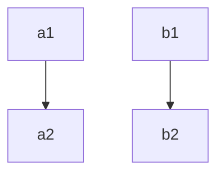
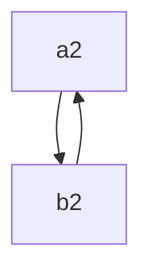

+++
title = "SSA构建和销毁"
date = 2025-03-18T09:19:42+00:00

+++


>ssa 构建和删除

# 1. SSA构建算法

>依赖：
>1. dom tree
>2. DF
>3. llvm ir基础知识

对以下c代码
```c
int foo(int a){
	int b = a;
	return b;
}
```
clang会生成类似这种IR
```c
define i32 @foo(i32 %a){
	%pa = alloc i32
	%pb = alloc i32
	store %a, %pa
	store %a, %pb
	%b1 = load %pb
	ret i32 %b1
}
```
我们能看到llvm采用了alloc+load+store指令来实现c中局部变量的存放。
这里参数处理`i32 %a; store %a, %pa`实际上是个比较复杂的话题，按下不表。
这段IR的有很多冗余的load/store, 有没有什么办法消除掉呢？
SROA（mem2reg）！
预期的IR
```c
define i32 @foo(i32 %a){
	ret i32 %a
}
```

如果控制流比较复杂呢？
```c
int b = a;
if(a > 10){
	b = b + a;
}else{
	b = b * a;
}
return b;
=> 
ir
bb0:
  %pb = alloc i32
  store %a, %pb
  %c = CMP_GT %a, 10
  br %c, %bb1, %bb2

bb1:
  %b0 = load %pb
  %b1 = add %b0, %a
  store %b1, %pb
  br %bb4

bb3:
  %b2 = load %pb
  %b3 = mul %b2, %a
  store %b3, %pb
  br %bb4
bb4:
  %b4 = load %pb
  ret %b4
```

这里我们发现，如果想要正确删除掉这些load/store，我们需要引入`phinode`,而且必须拿到控制流信息。phinode是个逻辑节点，在实际的CPU上没对应的指令/寄存器表示。所以我们在生成实际的汇编前需要再删除掉phi。

接下来看如何实现SSA构建：

原理分为两步, insertPHI, Rename， 伪代码如下：

```c

procedure InsertPHI(variable_list)

    for each variable v in variable_list
        WorkList ← ∅
        EverOnWorkList ← ∅
        AlreadyHasPhiFunc ← ∅
        for each node n containing an assignment to v
            WorkList ← WorkList ∪ {n}
        end

        EverOnWorkList ← WorkList
        while WorkList ≠ ∅
            Remove some node n from WorkList
            for each d ∈ DF(n)
                if d ∉ AlreadyHasPhiFunc
                    Insert a φ-function for v at d
                    AlreadyHasPhiFunc ← AlreadyHasPhiFunc ∪ {d}
                    if d ∉ EverOnWorkList
                        WorkList ← WorkList ∪ {d}
                        EverOnWorkList ← EverOnWorkList ∪ {d}
                    end
                end
            end
        end
    end
end procedure

  

procedure GenName(variable v)
    vn = new Value(v)
    Push vn onto Stacks[v]
    return v
end procedure

  

procedure Rename(block b)

    if b previously visited return
    for each φ-function p in b
        v = LHS(p)
        vn = GenName(v) and replace v with vn
    end

    for each statement s in b (in order)
        for each variable v ∈ RHS(s)
            replace v by Top(Stacks[v])
        end

        for each variable v ∈ LHS(s)
            vn = GenName(v) and replace v with vn
        end

        for each s ∈ succ(b) (in CFG)
            j ← position in s’s φ-function corresponding to block b
            for each φ-function p in s
                replace the jth operand of RHS(p) by Top(Stacks[v])
            end
        end
    end

    for each s ∈ child(b) (in DT)
        Rename(s)
    end

    for each φ-function or statement t in b
        for each vi ∈ LHS(t)
            Pop(Stacks[v])
        end
    end
end procedure

SSAConstruction:
    InsertPHI(list)
    Rename(entry)
end
```
我们看到这种伪代码的形式和LLVMIR区别很大。因为IR格式不一样，接下来看llvm ir下如何实现mem2reg


```c
mem2reg(Function f){
	list = []
	for inst in f.entry(){
		if inst is alloc and isPromotable(inst){
			// 有些alloc不能被删除，like volatile
			list.push(inst)
		}
	}
	if list.empty() return

	Phi2Alloc = InsertPHI(list)

	// init map: alloc -> stack<value>
	// with first value undef
	incomings_map = {} 
	for alloc in list {
		incomings_map[alloc] = [undef]
	}

	Rename(f.entry(), incomings_map, Phi2Alloc)
}

InsertPHI(list){
	Phi2Alloc = {}
	for alloc in list{
		WorkList = []
		for user in alloc.use_list(){
			if user is store {
				WorkList.push(user.parent())
			}
		}
		EverOnWorkList = WorkList.clone()
		AlreadyHasPhi = []

		while !WorkList.empty() {
			n = WorkList.pop()

			for d in DF(n) {
				if d not in AlreadyHasPhi {
					phi = create_phi()
					phi.set_all_incomings(undef)
					d.insert_front(phi)
					Phi2Alloc[phi] = alloc

					AlreadyHasPhi.add(d)
					if d not in EverOnWorkList {
						WorkList.push(d)
						EverOnWorkList.push(d)
					}
				}
			}
		}
	}
	return Phi2Alloc
}

PhiRename(bb, incomings_map, Phi2Alloc){
	if bb visited, return
	for inst in bb {
		if inst is phi {
			if inst not in Phi2Alloc
				continue
			alloc = Phi2Alloc[inst]
			incomings_map[alloc].push(phi) // update top
		
			continue
		}
		if inst is load {
			// %inst = load %address
			ad = inst.get_address();
			if(ad is alloc) {
				top = incomings_map[ad].top();
				inst.replaceAllUsesWith(top)
			}
			continue;
		}
		if inst is store {
			ad = inst.get_address()
			// store %x, %address
			if ad is alloc {
				// update top
				incomings_map[ad].push(inst.getValue());
			}
		}
	}
	for succ in b.getSuccessors() { // cfg
		for phi in succ.getPhiNodes() {
			alloc = Phi2Alloc[phi]
			top = incomings_map[alloc].top()
			phi.update_by_block(b, top) // update for incoming
		}
	}

	for child in DomTree(b).children() {
		// may cause stack over flow...
		Rename(child, incomings_map, Phi2Alloc)
	}

	// do pop stack
	for inst in b {
		if inst is phi {
			alloc = Phi2Alloc[phi]
			incomings_map[alloc].pop()
			continue
		}

		if inst is store {
			ad = inst.getAddress()
			incomings_map[ad].pop()
		}
	}
}

```

当然，以上代码不是llvm mem2reg实际实现代码。

llvm实现做了一些优化，domtree遍历优化，特殊情况处理等。


----

# SSA destruction

如何销毁SSA形式，删除phinode。

>llvm的phi-elimination是在mir阶段发生。

一般来说，SSA destruction是将phinode替换为copy指令。

1. 暴力做法，对于`p = phi (%a1, %bb1), (%a2, %bb2) ....`，在bb1,bb2... 尾部插入 `p = copy %a...` 然后删除掉phi节点。很不幸，改算法是错误的。
考虑到lost copy和swap problem：

![[static/images/Pasted image 20250314140205.png]]![[static/images/Pasted image 20250314140226.png]]
>ref [*Revisiting Out-of-SSA Translation for Correctness, Code Quality, and Efficiency](https://inria.hal.science/inria-00349925v1/document)

我们的暴力算法会生成
```c

swap problem:
b0:
	a1 = ...
	b1 = ...
	a2 = copy a1
	b2 = copy b1
	jump b1
b1:
	a2 = copy b2 <--- 没有swap
	b2 = copy a2

	if p jump b1
	jump b2
b2:
	...

lost-copy-problem

b0:
	x1 = ...
	x2 = copy x1
	jump b1
b1:
	x3 = x2 + 1
	x2 = copy x3
	if p jump b1
	jump b2
b2:
	... = x2  <---- 这里错误

```


2. split critical edges算法
>图中红边就是critical edge: 
> ![[static/images/Pasted image 20250314141430.png]]


![[static/images/Pasted image 20250314141816.png]]

![[static/images/Pasted image 20250314142302.png]]
swap problem结果看起来不太对哦。
看起来是插入copy出了问题, 再看一眼`a2=phi(a1, b2);b2=phi(b1,a2)`
![[static/images/Pasted image 20250314142521.png]]
是个环。。。

我们发现swap problem中
- a2和b2的生命周期重叠了
- 并且插入copy方式也需要改进

3. isolating phi + parallel copy
>先介绍几个概念
>- CSSA(Conventional SSA) form is defined as SSA form for which each phi-web is interference-free.
>- TSSA(Transformed SSA) form is non-conventional SSA, may have phi-web is not interference-free.

swap problem和lost-copy problem中 都是TSSA，而不是CSSA。
如何将TSSA转换为CSSA？并且在CSSA中插入copy是否还需要注意类似swapproblem的情况？

所以我们接下来的算法：
1. Insert parallel copies for all φ-functions （TSSA => CSSA）
2. eliminate phis in CSSA
3. Sequentialize parallel copies, possibly with one more variable and some additional copies
4. some optimization


>CSSA形式
>![[static/images/lost-copy.png]]![[static/images/swap.png]]
>这代码逻辑看起来是没问题了，就是代码质量堪忧。。。

消除phi节点后：

![[static/images/lost-copy-phi-elim.png]]
![[static/images/swap-phi-elim.png]]
上一小节提到的swap中copy的问题仍然存在，所以接下来要介绍，parallel copies的概念。
我们将这些插入的copy指令视为parallel copies，然后采用算法求解copy插入顺序

>![[static/images/Pasted image 20250314150937.png]]
>ref [Revisiting Out-of-SSA Translation for Correctness, Code Quality, and Efficiency](https://inria.hal.science/inria-00349925v1/document)
>不幸的是，这个算法有点小问题。
>实际上是个图遍历算法：[cc09.pdf](http://web.cs.ucla.edu/~palsberg/paper/cc09.pdf)


```python
class Copy:
    def __init__(self, src, dst):
        self.src = src
        self.dst = dst
    def __repr__(self):
        return "%s <- %s" % (self.dst, self.src)

def seq_copy(seq):
    ready = []
    todo = []
    pred = {}
    loc = {}
    n = "tmp"
  
    pred[n] = None
    for i in seq:
        a = i.src
        b = i.dst
        loc[b] = None
        pred[a] = None

    for i in seq:
        a = i.src
        b = i.dst
        loc[a] = a
        pred[b] = a
        todo.append(b)

    for i in seq:
        a = i.src
        b = i.dst
        if loc[b] is None:
            ready.append(b)
    while len(todo) != 0:
        while len(ready) != 0:
            b = ready.pop()
            a = pred[b]
            c = loc[a]
            print("emit copy {} <- {}".format(b, c))
            loc[a] = b
            if a ==c and pred[a] is not None:
                ready.append(a)
        b = todo.pop(0)
        l = loc[pred[b]]

        if b == l: # <<<<< 这里
            print("emit copy {}<- {}".format(n, b))
            loc[b] = n
            ready.append(b)
           
seq= [
    Copy("b", "a"),
    Copy("a", "b"),
]

seq_copy(seq)
```

>运行脚本，啥也不输出。
>但是如果我们将 `b==l`改成`b!=l`, 就会输出
>emit copy tmp<- a
>emit copy a <- b
>emit copy b <- tmp

至此，我们完成了phi-elimination的一半，合法化问题解决了。但是性能问题没解决。
优化：TODO


----

我们重新关注下parallel copies 。
```c

对于


bb1:
	a1 = ...
	b1 = ...
	c1 = ...
	jump bb

bb2:
	a2 = ...
	b2 = ...
	c2 = ...
	jump bb

bb3:
	a3 = ...
	b3 = ...
	c3 = ...
	jump bb

bb:
	a = phi(a1, a2, a3)
	b = phi(b1, b2, b3)
	c = phi(c1, c2, c3)

```


$$
\begin{bmatrix}
a \\
b \\
c
\end{bmatrix}
= 
Φ
\begin{bmatrix}
a1 & a2 & a3\\
b1 & b2 & b3\\
c1 & c2 & c3
\end{bmatrix}
$$
那么对于bb1来说，就有parallel copies: `a <- a1;b<-b1;c<-c1`
其对应的图**Location Transfer Graph**, G = (V, E), V = {a,b,c, a1, b1, c1}, E = { (`a <- a1, b<-b1, c<-c1`) }


再看下swap problem里面的
```c
a2 = phi(a1, b2)
b2 = phi(b1, a2)
```


1. 前驱1的parallel copies

2. 前驱2的parallel copies


----

参考

- https://www.cs.utexas.edu/~pingali/CS380C/2010/papers/ssaCytron.pdf
- https://ics.uci.edu/~yeouln/course/ssa.pdf
- [*Revisiting Out-of-SSA Translation for Correctness, Code Quality, and Efficiency](https://inria.hal.science/inria-00349925v1/document)
- [cc09.pdf](http://web.cs.ucla.edu/~palsberg/paper/cc09.pdf)