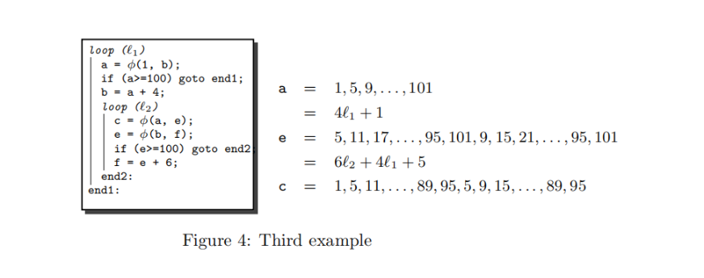

+++
title = "Scalar Evolution介绍"

+++

Scalar Evolution， 标量演进，简单理解在循环中，随着循环迭代，其值是如何变化的。

# 定义

例子：

```c
for(int i=0;i<10;i++){
    int a = i*10;
    int b = i*i + a;
}

```
对这个循环来说，
i = 0,  1,  2, ...,   9
a = 0, 10, 20, ...,  90
b = 0, 11, 24, ..., 165

对于更复杂情况呢？
所以需要一种代数来表示循环内的值是怎么变化的。


定义**Basic Recurrences BR**: $f = \lbrace \varphi, \odot , y \rbrace_{l} $
其中$\varphi$是循环不变量，$y$是个函数，$l$是所在循环，$\odot 是 +或者*$。
$f(i)$ 就是第$i$次迭代时的值.


$\lbrace \varphi, +, y \rbrace_{l} (i) = \varphi +  \sum \limits _{j=0}^{i-1} y(j)$
$\lbrace \varphi, *, y \rbrace_{l} (i) = \varphi *  \prod \limits _{j=0}^{i-1} y(j)$

>注意到$f(i) = f(i-1) \odot y(i-1) $
>还是上面的例子: a(8) = 80 = 70 + 10 = a(7) + 10

所以BR是`first order linear recurrences`的特例.

为了表示更复杂的公式，定义**Chain of Recurrences CR**:
$\Phi = \lbrace a_0, O_1, a_1, O_2, ...., a_{k-1},  O_k, f_k \rbrace $
其中 $a_0, a_1, ..., a_{k-1}$ 是常数, $O_1, O_2, ..., O_k$ 是操作符, $f_k$ 是函数.

当然也可以再扩展下，定义**Tree of Recurrences TREC**：
$ \Theta = \lbrace \Theta_a, +, \Theta_b \rbrace_l $
其中 $\Theta_a, \Theta_b$ 也是 $TREC$

并且$\lbrace \Theta_a, +, \lbrace \Theta_b, +, \Theta_c   \rbrace_l  \rbrace_l  $可以简写为 $  \lbrace \Theta_a, +,  \Theta_b, +, \Theta_c \rbrace_l  $

> 参考2 `Fast Recognition of Scalar Evolutions on Three-Address SSA Code`

# CR和多项式对应关系

我们定义CR是为了方便进行代数计算。所以需要先讨论下计算公式。

首先$factorials$ of form $x^{(n)}$ 是
$ x^{(n)} = x(x-1)(x-2)...(x-n+1) \space\space  with \space  x^{(0)} =1$
阶乘多项式是：
$ a_0 + a_1 x^{(1)} + a_2 x^{(2)} + ... + a_n x^{(n)} $
也可以将 $x^{(n)} $转换为多项式形式。
$$
x^{(n)} =  s_{n1} x + s_{n2} x^2 + ... + s_{nn} x^n
$$
$$ x^n = t_{n1} x^{(1)} + t_{n2} x^{(2)} + ... + t_{nn} x^{(n)} $$

其中$ s_{ij}, t_{ij} $ 是Stirling numbers 

所以如果CR与多项式公式之间的转换就很重要了。
比如说$G(x) = 2x^2 + x + 1$ 对应 $\lbrace ?, +, ?, +, ? \rbrace$
或者$\lbrace 1,+, 2,+,3 \rbrace $对应$ H(x) = ?x^2 + ?x + ? $


## CR之间的计算


## 识别算法
详见`Fast Recognition of Scalar Evolutions on Three-Address SSA Code`


## llvm 中实现

1. 调试打印

`opt -passes=print<scalar-evolution> a.ll `

如果不太清楚就去`llvm/test/Analysis/ScalarEvolution`目录下copy。

1. 实现细节
llvm中并没有`peeled REC`相关逻辑

 
>ref 2,  llvm中c对应unknown

```ir
 @.str = private unnamed_addr constant [3 x i8] c"%d\00", align 1

define dso_local i32 @test_scev(ptr noundef readnone captures(none) %0) local_unnamed_addr #0 {
  br label %2

2:
  %3 = phi i32 [ 1, %1 ], [ %8, %7 ]
  %4 = shl nuw nsw i32 %3, 1
  %5 = add nuw nsw i32 %4, 4
  br label %10

6:
  ret i32 undef

7:
  %8 = add nuw nsw i32 %3, 1
  %9 = icmp eq i32 %8, 100
  br i1 %9, label %6, label %2

10:
  %11 = phi i32 [ %3, %2 ], [ %e, %10 ]
  %e = phi i32 [%5, %2], [%13, %10]
  %12 = tail call i32 (ptr, ...) @printf(ptr noundef nonnull dereferenceable(1) @.str, i32 noundef %5)
  %13 = add nuw nsw i32 %11, 6
  %14 = icmp samesign ult i32 %e, 194
  br i1 %14, label %10, label %7
}

declare noundef i32 @printf(ptr noundef readonly captures(none), ...) local_unnamed_addr #1
```
这段代码的结果是

```txt
Printing analysis 'Scalar Evolution Analysis' for function 'test_scev':
Classifying expressions for: @test_scev
  %3 = phi i32 [ 1, %1 ], [ %8, %7 ]
  -->  {1,+,1}<nuw><nsw><%2> U: [1,100) S: [1,100)		Exits: 99		LoopDispositions: { %2: Computable, %10: Invariant }
  %4 = shl nuw nsw i32 %3, 1
  -->  {2,+,2}<nuw><nsw><%2> U: [2,199) S: [2,199)		Exits: 198		LoopDispositions: { %2: Computable, %10: Invariant }
  %5 = add nuw nsw i32 %4, 4
  -->  {6,+,2}<nuw><nsw><%2> U: [6,203) S: [6,203)		Exits: 202		LoopDispositions: { %2: Computable, %10: Invariant }
  %8 = add nuw nsw i32 %3, 1
  -->  {2,+,1}<nuw><nsw><%2> U: [2,101) S: [2,101)		Exits: 100		LoopDispositions: { %2: Computable, %10: Invariant }
  %11 = phi i32 [ %3, %2 ], [ %e, %10 ]
  -->  %11 U: [0,-2147483648) S: [1,-2147483648)		Exits: <<Unknown>>		LoopDispositions: { %10: Variant, %2: Variant }
  %e = phi i32 [ %5, %2 ], [ %13, %10 ]
  -->  %e U: [6,-2147483642) S: [6,-2147483642)		Exits: <<Unknown>>		LoopDispositions: { %10: Variant, %2: Variant }
  %12 = tail call i32 (ptr, ...) @printf(ptr noundef nonnull dereferenceable(1) @.str, i32 noundef %5)
  -->  %12 U: full-set S: full-set		Exits: <<Unknown>>		LoopDispositions: { %10: Variant, %2: Variant }
  %13 = add nuw nsw i32 %11, 6
  -->  (6 + %11)<nuw> U: [6,-2147483642) S: [6,-2147483642)		Exits: <<Unknown>>		LoopDispositions: { %10: Variant, %2: Variant }
Determining loop execution counts for: @test_scev
Loop %10: Unpredictable backedge-taken count.
Loop %10: Unpredictable constant max backedge-taken count. 
Loop %10: Unpredictable symbolic max backedge-taken count. 
Loop %2: backedge-taken count is i32 98
Loop %2: constant max backedge-taken count is i32 98
Loop %2: symbolic max backedge-taken count is i32 98
Loop %2: Trip multiple is 99
Compiler returned: 0


```


-------------------------------------------------------------------------------


参考：
1.  Chains of Recurrences - a method to expedite the evaluation of closed-form functions 
    https://bohr.wlu.ca/ezima/papers/ISSAC94_p242-bachmann.pdf
2. Fast Recognition of Scalar Evolutions on Three-Address SSA Code
   https://www.researchgate.net/publication/267701684_Fast_Recognition_of_Scalar_Evolutions_on_Three-Address_SSA_Code

3. https://llvm.org/devmtg/2009-10/ScalarEvolutionAndLoopOptimization.pdf
4. https://llvm.org/devmtg/2018-04/slides/Absar-ScalarEvolution.pdf