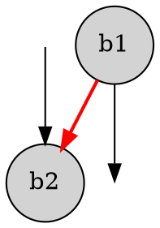
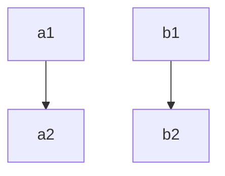
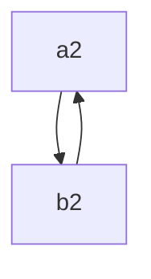

>phinode的创建和消除

# 1. SSA构建算法

>依赖：
>1. dom tree
>2. DF
>3. llvm ir基础知识

对以下c代码
```c
int foo(int a){
	int b = a;
	return b;
}
```
clang会生成类似这种IR
```c
define i32 @foo(i32 %a){
	%pa = alloc i32
	%pb = alloc i32
	store %a, %pa
	store %a, %pb
	%b1 = load %pb
	ret i32 %b1
}
```
我们能看到llvm采用了alloc+load+store指令来实现c中局部变量的存放。
这里参数处理`i32 %a; store %a, %pa`实际上是个比较复杂的话题，按下不表。
这段IR的有很多冗余的load/store, 有没有什么办法消除掉呢？
SROA（mem2reg）！
预期的IR
```c
define i32 @foo(i32 %a){
	ret i32 %a
}
```

如果控制流比较复杂呢？
```c
int b = a;
if(a > 10){
	b = b + a;
}else{
	b = b * a;
}
return b;
=> 
ir
bb0:
  %pb = alloc i32
  store %a, %pb
  %c = CMP_GT %a, 10
  br %c, %bb1, %bb2

bb1:
  %b0 = load %pb
  %b1 = add %b0, %a
  store %b1, %pb
  br %bb4

bb3:
  %b2 = load %pb
  %b3 = mul %b2, %a
  store %b3, %pb
  br %bb4
bb4:
  %b4 = load %pb
  ret %b4
```

这里我们发现，如果想要正确删除掉这些load/store，我们需要引入`phinode`,而且必须拿到控制流信息。phinode是个逻辑节点，在实际的CPU上没对应的指令/寄存器表示。所以我们在生成实际的汇编前需要再删除掉phi。

接下来看如何实现SSA构建：

原理分为两步, insertPHI, Rename， 伪代码如下：

```c

procedure InsertPHI(variable_list)

    for each variable v in variable_list
        WorkList ← ∅
        EverOnWorkList ← ∅
        AlreadyHasPhiFunc ← ∅
        for each node n containing an assignment to v
            WorkList ← WorkList ∪ {n}
        end

        EverOnWorkList ← WorkList
        while WorkList ≠ ∅
            Remove some node n from WorkList
            for each d ∈ DF(n)
                if d ∉ AlreadyHasPhiFunc
                    Insert a φ-function for v at d
                    AlreadyHasPhiFunc ← AlreadyHasPhiFunc ∪ {d}
                    if d ∉ EverOnWorkList
                        WorkList ← WorkList ∪ {d}
                        EverOnWorkList ← EverOnWorkList ∪ {d}
                    end
                end
            end
        end
    end
end procedure

  

procedure GenName(variable v)
    vn = new Value(v)
    Push vn onto Stacks[v]
    return v
end procedure

  

procedure Rename(block b)

    if b previously visited return
    for each φ-function p in b
        v = LHS(p)
        vn = GenName(v) and replace v with vn
    end

    for each statement s in b (in order)
        for each variable v ∈ RHS(s)
            replace v by Top(Stacks[v])
        end

        for each variable v ∈ LHS(s)
            vn = GenName(v) and replace v with vn
        end

        for each s ∈ succ(b) (in CFG)
            j ← position in s’s φ-function corresponding to block b
            for each φ-function p in s
                replace the jth operand of RHS(p) by Top(Stacks[v])
            end
        end
    end

    for each s ∈ child(b) (in DT)
        Rename(s)
    end

    for each φ-function or statement t in b
        for each vi ∈ LHS(t)
            Pop(Stacks[v])
        end
    end
end procedure

SSAConstruction:
    InsertPHI(list)
    Rename(entry)
end
```
我们看到这种伪代码的形式和LLVMIR区别很大。因为IR格式不一样，接下来看llvm ir下如何实现mem2reg


```c
mem2reg(Function f){
	list = []
	for inst in f.entry(){
		if inst is alloc and isPromotable(inst){
			// 有些alloc不能被删除，like volatile
			list.push(inst)
		}
	}
	if list.empty() return

	Phi2Alloc = InsertPHI(list)

	// init map: alloc -> stack<value>
	// with first value undef
	incomings_map = {} 
	for alloc in list {
		incomings_map[alloc] = [undef]
	}

	Rename(f.entry(), incomings_map, Phi2Alloc)
}

InsertPHI(list){
	Phi2Alloc = {}
	for alloc in list{
		WorkList = []
		for user in alloc.use_list(){
			if user is store {
				WorkList.push(user.parent())
			}
		}
		EverOnWorkList = WorkList.clone()
		AlreadyHasPhi = []

		while !WorkList.empty() {
			n = WorkList.pop()

			for d in DF(n) {
				if d not in AlreadyHasPhi {
					phi = create_phi()
					phi.set_all_incomings(undef)
					d.insert_front(phi)
					Phi2Alloc[phi] = alloc

					AlreadyHasPhi.add(d)
					if d not in EverOnWorkList {
						WorkList.push(d)
						EverOnWorkList.push(d)
					}
				}
			}
		}
	}
	return Phi2Alloc
}

PhiRename(bb, incomings_map, Phi2Alloc){
	if bb visited, return
	for inst in bb {
		if inst is phi {
			if inst not in Phi2Alloc
				continue
			alloc = Phi2Alloc[inst]
			incomings_map[alloc].push(phi) // update top
		
			continue
		}
		if inst is load {
			// %inst = load %address
			ad = inst.get_address();
			if(ad is alloc) {
				top = incomings_map[ad].top();
				inst.replaceAllUsesWith(top)
			}
			continue;
		}
		if inst is store {
			ad = inst.get_address()
			// store %x, %address
			if ad is alloc {
				// update top
				incomings_map[ad].push(inst.getValue());
			}
		}
	}
	for succ in b.getSuccessors() { // cfg
		for phi in succ.getPhiNodes() {
			alloc = Phi2Alloc[phi]
			top = incomings_map[alloc].top()
			phi.update_by_block(b, top) // update for incoming
		}
	}

	for child in DomTree(b).children() {
		// may cause stack over flow...
		Rename(child, incomings_map, Phi2Alloc)
	}

	// do pop stack
	for inst in b {
		if inst is phi {
			alloc = Phi2Alloc[phi]
			incomings_map[alloc].pop()
			continue
		}

		if inst is store {
			ad = inst.getAddress()
			incomings_map[ad].pop()
		}
	}
}

```

当然，以上代码不是llvm mem2reg实际实现代码。

llvm实现做了一些优化，domtree遍历优化，特殊情况处理等。

----

# SSA destruction

如何销毁SSA形式，删除phinode。

>llvm的phi-elimination是在mir阶段发生。

一般来说，SSA destruction是将phinode替换为copy指令。

1. 暴力做法，对于`p = phi (%a1, %bb1), (%a2, %bb2) ....`，在bb1,bb2... 尾部插入 `p = copy %a...` 然后删除掉phi节点。但是该做法结果不对。

考虑到lost copy problem和swap problem：


```txt

// Revisiting Out-of-SSA Translation for Correctness, Code Quality, and Efficiency
// https://inria.hal.science/inria-00349925v1/document

lost copy problem:

b0:
	x1 =...
	jmp b1

b1:						  
	x2 = phi(x1, x3)      
	x3 = x2 + 1			  
	...
	jmp p, b1, b2


-----------------------

swap problem:

b0:
	a1 =...
	b1 =...
	jmp b1

b1:          
	a2 = phi(a1, b2)      
	b2 = phi(b1, a2)      
    ...                      
	jmp p, b1, b2        		  
	
```

我们的暴力算法会生成
```c

swap problem:
b0:
	a1 = ...
	b1 = ...
	a2 = copy a1
	b2 = copy b1
	jump b1
b1:
	a2 = copy b2 <--- 没有swap
	b2 = copy a2

	if p jump b1
	jump b2
b2:
	...


--------------------------------------------

lost-copy-problem

b0:
	x1 = ...
	x2 = copy x1
	jump b1
b1:
	x3 = x2 + 1
	x2 = copy x3
	if p jump b1
	jump b2
b2:
	... = x2  <---- 这里错误

```


### split critical edges


图中红边就是critical edge: 


对lost copy和swap应用该算法：

```txt

lost-copy-problem

b0:
	x1 =...
	x2 = copy x1
	jmp b1

b1:
	x3 = x2 + 1
	jmp p, b3, b2

b3:
	x2 = copy x3
	jmp b1

b2:
	... = x2

---------------------------------------------------

swap problem

bb0:
	a1 =...
	b1 =...
	a2 = copy a1
	b2 = copy b1
	jmp bb1

bb1:

	jmp p, bb3, bb2

bb3:
	a2 = copy b2  <--- 没有swap
	b2 = copy a2
	jmp bb1

bb2:
	... = a2
	... = b2

```

swap problem结果看起来不太对哦。
看起来是插入copy出了问题, 再看一眼`a2=phi(a1, b2);b2=phi(b1,a2)` a2, b2形成了环。
是个环。。。

我们发现swap problem中
- a2和b2的生命周期重叠了
- 并且插入copy方式也需要改进

### isolating phi + parallel copy

>先介绍几个概念
>- CSSA(Conventional SSA) form is defined as SSA form for which each phi-web is interference-free.
>- TSSA(Transformed SSA) form is non-conventional SSA, may have phi-web is not interference-free.

swap problem和lost-copy problem中 都是TSSA，而不是CSSA。
如何将TSSA转换为CSSA？并且在CSSA中插入copy是否还需要注意类似swapproblem的情况？

所以我们接下来的算法步骤是：
1. Insert parallel copies for all φ-functions （TSSA => CSSA）
2. eliminate phis in CSSA
3. Sequentialize parallel copies, possibly with one more variable and some additional copies
4. some optimization


首先转换为cssa格式
```txt

lost copy problem

b0:
	x1 =...
	x1' = copy x1
	jmp b1

b1:
	x2' = phi(x1', x3')
	x2 = copy x2'
	x3 = x2 + 1
	x3' = copy x3

	jmp p, b1, b2

b2:
	... = x2


----------------------------------------

swap problem:

B0:
	a1 =...
	b1 =...
	a1' = copy a1
	b1' = copy b1
	jmp B1

B1:
	a2' = phi(a1', b2')
	b2' = phi(b1', a2')
	a2 = copy a2'
	b2 = copy b2'
	b2' = copy b2
	a2' = copy a2
   	...
	jmp p, B1, B2

B2:
	... = a2
	... = b2

```

消除phi节点后：

```txt

lost copy problem

b0:
	x1 =...
	x1' = copy x1
	x2' = copy x1'      // x1' in x2' = phi(x1', x3')
	jmp b1

b1:
	x2 = copy x2'
	x3 = x2 + 1
	x3' = copy x3
	x2' = x3'            // x3' in x2' = phi(x1', x3')
	jmp p, b1, b2

b2:
	... = x2


----------------------------------------

swap problem:

B0:
	a1 =...
	b1 =...
	a1' = copy a1
	b1' = copy b1
	a2' = copy a1'   // a1' in a2' = phi(a1', b2')
	b2' = copy b1'	 // b1' in b2' = phi(b1', a2')
	jmp B1

B1:
	a2 = copy a2'
	b2 = copy b2'
	b2' = copy b2
	a2' = copy a2
   	a2' = copy b2'  // a2' in a2' = phi(a1', b2')
	b2' = copy a2'  // b2' in b2' = phi(b1', a2')
	jmp p, B1, B2

B2:
	... = a2
	... = b2

```
上一小节提到的swap中copy的问题仍然存在，所以接下来要介绍，parallel copies的概念。
我们将这些插入的copy指令视为parallel copies，然后采用算法求解copy插入顺序

```txt
// Revisiting Out-of-SSA Translation for Correctness, Code Quality, and Efficiency (https://inria.hal.science/inria-00349925v1/document)

// @args
// Set P of parallel copies of the form a -> b, a != b
// n: one extra fresh variable
// @output:  List of copies in sequential order
def parallel_copy_sequentialization(P:set, n: variable) 
	
	ready = []
	to_do = []
	pred(n) = none // a map

	for a -> b in p
		loc(b) = none               // init
		pred(b) = none
	end for

	for a -> b in p    
		loc(a) = a                    /* needed and not copied yet */
		pred(b) = a                   /* (unique) predecessor *
		to_do.append(b)               /* copy into b to be done */

	for a->b in p
		if loc(b) == none
			ready.append(b)            /* b is not used and can be overwritten */
		
	while to_do != []
		while ready != []
			b = ready.pop()
			a = pred(b)
			c = loc(a)
			emit copy c -> b
			
			loc(a) = b
			if a == c and pred(a) != none
				ready.append(a)
		b = to_do.pop()
		l = loc(pred(b))
		if b == l
			emit copy b -> n
			loc(b) = n
			ready.append(b)

```

>不幸的是，这个算法有点小问题。
>实际上是个图遍历算法：[cc09.pdf](http://web.cs.ucla.edu/~palsberg/paper/cc09.pdf)

我们用python写个demo：
```python
class Copy:
    def __init__(self, src, dst):
        self.src = src
        self.dst = dst
    def __repr__(self):
        return "%s <- %s" % (self.dst, self.src)

def seq_copy(seq):
    ready = []
    todo = []
    pred = {}
    loc = {}
    n = "tmp"
  
    pred[n] = None
    for i in seq:
        a = i.src
        b = i.dst
        loc[b] = None
        pred[a] = None

    for i in seq:
        a = i.src
        b = i.dst
        loc[a] = a
        pred[b] = a
        todo.append(b)

    for i in seq:
        a = i.src
        b = i.dst
        if loc[b] is None:
            ready.append(b)


    while len(todo) != 0:
        while len(ready) != 0:
            b = ready.pop()
            a = pred[b]
            c = loc[a]
            print("emit copy {} <- {}".format(b, c))
            loc[a] = b
            if a ==c and pred[a] is not None:
                ready.append(a)
        b = todo.pop(0)
        l = loc[pred[b]]

        if b == l: # <<<<< 这里
            print("emit copy {}<- {}".format(n, b))
            loc[b] = n
            ready.append(b)
           
seq= [
    Copy("b", "a"),
    Copy("a", "b"),
]

seq_copy(seq)
```

>运行脚本，啥也不输出。
>但是如果我们将 `b==l`改成`b!=l`, 就会输出
>emit copy tmp<- a
>emit copy a <- b
>emit copy b <- tmp

至此，我们完成了phi-elimination的一半，合法化问题解决了。但是性能问题没解决。

对于lost copy problem，在BB块前插入copy指令是必须的。（如果采用Split Critical Edges的方式，循环的代码质量会下降）
对于swap problem，需检测环的出现。

copy插入位置问题，lost copy 和swap problem插入顺序还不一样。
~~这帮人写论文能不能靠谱点~~

### llvm采用的算法

llvm有split critical edge也有不依赖split critical edge的实现。
parallel copy面对如下代码还是有些问题
```c
// 格式化整型的代码实现
int value = ....;
do{
	int a = value % base;
	value = value / base;

	buf[len++] = a;

} while(value)

```
原因还是copy插入顺序。（parallel copies的遍历顺序）
解决方法，额。
根据llvm中split critical edges的方法。
如果phi的incoming block是critical edge 的src block，例如 `bb0：a0 = phi a1,bb1, a2, bb2` 其中bb2是critical edge，那么在bb1尾部创建`tmp = copy a1`, 在bb0头部`a0 = copy tmp`, 在bb2尾部`tmp = copy a2`.
如果没有critical edge, 直接copy，bb1尾部创建`a0 = copy a1`,bb2尾部`a0 = copy a2`.

很简单的实现，但是还是挺有效。。。

https://gcc.godbolt.org/z/aMWPjK3a9


为什么不split block呢？因为跳转太多会导致性能下降，特别是在loop中。

---

## 优化问题

关键字：copy de-coalescing

即如何最小化插入copy指令 
1. 在CSSA上面对parallel copies 优化
2. 先生成很多冗余的copy指令，然后再优化这些copy指令

第一种方式有些困难，个人认为难点在于parallel copies相关生命周期如何计算。
第二种方式就很传统了, interference graph + union find， 不干涉的放在一个点集里面。


----

## others

我们重新关注下parallel copies 。
```c

对于


bb1:
	a1 = ...
	b1 = ...
	c1 = ...
	jump bb

bb2:
	a2 = ...
	b2 = ...
	c2 = ...
	jump bb

bb3:
	a3 = ...
	b3 = ...
	c3 = ...
	jump bb

bb:
	a = phi(a1, a2, a3)
	b = phi(b1, b2, b3)
	c = phi(c1, c2, c3)

```

---

>注意`\\`可能会被识别为`\`, 用`\newline`更好

$\begin{bmatrix} a \newline b \newline c \end{bmatrix}
 = Φ \begin{bmatrix} a1 & a2 & a3 \newline b1 & b2 & b3 \newline c1 &c2 & c3 \end{bmatrix} $

那么对于bb1来说，就有parallel copies: $a \gets a1, b \gets b1, c \gets c1$。
其对应的**Location Transfer Graph**为$G = (V, E), V = \lbrace a,b,c, a1, b1, c1\rbrace, E = \lbrace a \gets a1, b \gets b1, c \gets c1 \rbrace$


再看下swap problem里面的
```c
a2 = phi(a1, b2)
b2 = phi(b1, a2)
```


1. 前驱1的parallel copies

2. 前驱2的parallel copies


----

参考

- https://www.cs.utexas.edu/~pingali/CS380C/2010/papers/ssaCytron.pdf
- https://ics.uci.edu/~yeouln/course/ssa.pdf
- [Revisiting Out-of-SSA Translation for Correctness, Code Quality, and Efficiency](https://inria.hal.science/inria-00349925v1/document)
- [cc09.pdf](http://web.cs.ucla.edu/~palsberg/paper/cc09.pdf)


----
llvm实现。

```txt
int cond_random();

void swap_p(int a, int b, int *arr){

    while(cond_random() ){
        int tmp = a;
        a = b;
        b = tmp;
    }
    *arr++ = a;
    *arr++ = b;
}


void lost_copy(int a, int *p){

    while(cond_random()){
        a+=1;
    }
    *p = a;
}

```

### lost copy

```txt

# Machine code for function lost_copy(int, int*): IsSSA, TracksLiveness
Function Live Ins: $edi in %3, $rsi in %4

bb.0.entry:
  successors: %bb.1(0x80000000); %bb.1(100.00%)
  liveins: $edi, $rsi
  %4:gr64 = COPY killed $rsi
  %3:gr32 = COPY killed $edi
  %0:gr32 = DEC32r killed %3:gr32(tied-def 0), implicit-def dead $eflags; example.cpp:19:5

bb.1.while.cond:
; predecessors: %bb.0, %bb.1
  successors: %bb.2(0x04000000), %bb.1(0x7c000000); %bb.2(3.12%), %bb.1(96.88%)

  %1:gr32 = PHI %0:gr32, %bb.0, %2:gr32, %bb.1, debug-instr-number 1
  ADJCALLSTACKDOWN64 0, 0, 0, implicit-def dead $rsp, implicit-def dead $eflags, implicit-def dead $ssp, implicit $rsp, implicit $ssp; example.cpp:19:11
  CALL64pcrel32 target-flags(x86-plt) @cond_random(), <regmask $bh $bl $bp $bph $bpl $bx $ebp $ebx $hbp $hbx $rbp $rbx $r12 $r13 $r14 $r15 $r12b $r13b $r14b $r15b $r12bh $r13bh $r14bh $r15bh $r12d $r13d $r14d $r15d $r12w $r13w $r14w $r15w $r12wh and 3 more...>, implicit $rsp, implicit $ssp, implicit-def $rsp, implicit-def $ssp, implicit-def $eax; example.cpp:19:11
  ADJCALLSTACKUP64 0, 0, implicit-def dead $rsp, implicit-def dead $eflags, implicit-def dead $ssp, implicit $rsp, implicit $ssp; example.cpp:19:11
  %5:gr32 = COPY killed $eax; example.cpp:19:11
  %2:gr32 = INC32r killed %1:gr32(tied-def 0), implicit-def dead $eflags; example.cpp:19:5
  TEST32rr killed %5:gr32, %5:gr32, implicit-def $eflags; example.cpp:19:11
  JCC_1 %bb.1, 5, implicit killed $eflags; example.cpp:19:5
  JMP_1 %bb.2; example.cpp:19:5

bb.2.while.end:
; predecessors: %bb.1

  MOV32mr killed %4:gr64, 1, $noreg, 0, $noreg, killed %2:gr32 :: (store (s32) into %ir.p); example.cpp:22:8
  RET 0; example.cpp:23:1

# End machine code for function lost_copy(int, int*).


# Machine code for function lost_copy(int, int*): NoPHIs, TracksLiveness
Function Live Ins: $edi in %3, $rsi in %4

bb.0.entry:
  successors: %bb.1(0x80000000); %bb.1(100.00%)
  liveins: $edi, $rsi
  %4:gr64 = COPY killed $rsi
  %3:gr32 = COPY killed $edi
  %0:gr32 = DEC32r killed %3:gr32(tied-def 0), implicit-def dead $eflags; example.cpp:19:5
  %6:gr32 = COPY killed %0:gr32

bb.1.while.cond:
; predecessors: %bb.0, %bb.1
  successors: %bb.2(0x04000000), %bb.1(0x7c000000); %bb.2(3.12%), %bb.1(96.88%)

  %1:gr32 = COPY killed %6:gr32
  ADJCALLSTACKDOWN64 0, 0, 0, implicit-def dead $rsp, implicit-def dead $eflags, implicit-def dead $ssp, implicit $rsp, implicit $ssp; example.cpp:19:11
  CALL64pcrel32 target-flags(x86-plt) @cond_random(), <regmask $bh $bl $bp $bph $bpl $bx $ebp $ebx $hbp $hbx $rbp $rbx $r12 $r13 $r14 $r15 $r12b $r13b $r14b $r15b $r12bh $r13bh $r14bh $r15bh $r12d $r13d $r14d $r15d $r12w $r13w $r14w $r15w $r12wh and 3 more...>, implicit $rsp, implicit $ssp, implicit-def $rsp, implicit-def $ssp, implicit-def $eax; example.cpp:19:11
  ADJCALLSTACKUP64 0, 0, implicit-def dead $rsp, implicit-def dead $eflags, implicit-def dead $ssp, implicit $rsp, implicit $ssp; example.cpp:19:11
  %5:gr32 = COPY killed $eax; example.cpp:19:11
  %2:gr32 = INC32r killed %1:gr32(tied-def 0), implicit-def dead $eflags; example.cpp:19:5
  TEST32rr killed %5:gr32, %5:gr32, implicit-def $eflags; example.cpp:19:11
  %6:gr32 = COPY %2:gr32
  JCC_1 %bb.1, 5, implicit killed $eflags; example.cpp:19:5
  JMP_1 %bb.2; example.cpp:19:5

bb.2.while.end:
; predecessors: %bb.1

  MOV32mr killed %4:gr64, 1, $noreg, 0, $noreg, killed %2:gr32 :: (store (s32) into %ir.p); example.cpp:22:8
  RET 0; example.cpp:23:1

# End machine code for function lost_copy(int, int*).

# Machine code for function lost_copy(int, int*): NoPHIs, TracksLiveness, TiedOpsRewritten
Function Live Ins: $edi in %3, $rsi in %4

0B	bb.0.entry:
	  successors: %bb.1(0x80000000); %bb.1(100.00%)
	  liveins: $edi, $rsi
16B	  %4:gr64 = COPY $rsi
32B	  %6:gr32 = COPY $edi
64B	  %6:gr32 = DEC32r %6:gr32(tied-def 0), implicit-def dead $eflags; example.cpp:19:5

96B	bb.1.while.cond:
	; predecessors: %bb.0, %bb.1
	  successors: %bb.2(0x04000000), %bb.1(0x7c000000); %bb.2(3.12%), %bb.1(96.88%)

128B	  ADJCALLSTACKDOWN64 0, 0, 0, implicit-def dead $rsp, implicit-def dead $eflags, implicit-def dead $ssp, implicit $rsp, implicit $ssp; example.cpp:19:11
144B	  CALL64pcrel32 target-flags(x86-plt) @cond_random(), <regmask $bh $bl $bp $bph $bpl $bx $ebp $ebx $hbp $hbx $rbp $rbx $r12 $r13 $r14 $r15 $r12b $r13b $r14b $r15b $r12bh $r13bh $r14bh $r15bh $r12d $r13d $r14d $r15d $r12w $r13w $r14w $r15w $r12wh and 3 more...>, implicit $rsp, implicit $ssp, implicit-def $rsp, implicit-def $ssp, implicit-def $eax; example.cpp:19:11
160B	  ADJCALLSTACKUP64 0, 0, implicit-def dead $rsp, implicit-def dead $eflags, implicit-def dead $ssp, implicit $rsp, implicit $ssp; example.cpp:19:11
176B	  %5:gr32 = COPY killed $eax; example.cpp:19:11
208B	  %6:gr32 = INC32r %6:gr32(tied-def 0), implicit-def dead $eflags; example.cpp:19:5
224B	  TEST32rr %5:gr32, %5:gr32, implicit-def $eflags; example.cpp:19:11
256B	  JCC_1 %bb.1, 5, implicit killed $eflags; example.cpp:19:5
272B	  JMP_1 %bb.2; example.cpp:19:5

288B	bb.2.while.end:
	; predecessors: %bb.1

304B	  MOV32mr %4:gr64, 1, $noreg, 0, $noreg, %6:gr32 :: (store (s32) into %ir.p); example.cpp:22:8
320B	  RET 0; example.cpp:23:1

# End machine code for function lost_copy(int, int*).

```

### swap

```txt

# Machine code for function swap_p(int, int, int*): IsSSA, TracksLiveness
Function Live Ins: $edi in %2, $esi in %3, $rdx in %4

bb.0.entry:
  successors: %bb.1(0x80000000); %bb.1(100.00%)
  liveins: $edi, $esi, $rdx
  %4:gr64 = COPY killed $rdx
  %3:gr32 = COPY killed $esi
  %2:gr32 = COPY killed $edi

bb.1.while.cond:
; predecessors: %bb.0, %bb.1
  successors: %bb.2(0x04000000), %bb.1(0x7c000000); %bb.2(3.12%), %bb.1(96.88%)

  %0:gr32 = PHI %3:gr32, %bb.0, %1:gr32, %bb.1, debug-instr-number 2
  %1:gr32 = PHI %2:gr32, %bb.0, %0:gr32, %bb.1, debug-instr-number 1
  ADJCALLSTACKDOWN64 0, 0, 0, implicit-def dead $rsp, implicit-def dead $eflags, implicit-def dead $ssp, implicit $rsp, implicit $ssp; example.cpp:7:11
  CALL64pcrel32 target-flags(x86-plt) @cond_random(), <regmask $bh $bl $bp $bph $bpl $bx $ebp $ebx $hbp $hbx $rbp $rbx $r12 $r13 $r14 $r15 $r12b $r13b $r14b $r15b $r12bh $r13bh $r14bh $r15bh $r12d $r13d $r14d $r15d $r12w $r13w $r14w $r15w $r12wh and 3 more...>, implicit $rsp, implicit $ssp, implicit-def $rsp, implicit-def $ssp, implicit-def $eax; example.cpp:7:11
  ADJCALLSTACKUP64 0, 0, implicit-def dead $rsp, implicit-def dead $eflags, implicit-def dead $ssp, implicit $rsp, implicit $ssp; example.cpp:7:11
  %5:gr32 = COPY killed $eax; example.cpp:7:11
  TEST32rr killed %5:gr32, %5:gr32, implicit-def $eflags; example.cpp:7:11
  JCC_1 %bb.1, 5, implicit killed $eflags; example.cpp:7:5
  JMP_1 %bb.2; example.cpp:7:5

bb.2.while.end:
; predecessors: %bb.1

  MOV32mr %4:gr64, 1, $noreg, 0, $noreg, killed %1:gr32 :: (store (s32) into %ir.arr); example.cpp:12:12
  MOV32mr killed %4:gr64, 1, $noreg, 4, $noreg, killed %0:gr32 :: (store (s32) into %ir.incdec.ptr); example.cpp:13:12
  RET 0; example.cpp:14:1

# End machine code for function swap_p(int, int, int*).


# Machine code for function swap_p(int, int, int*): NoPHIs, TracksLiveness
Function Live Ins: $edi in %2, $esi in %3, $rdx in %4

bb.0.entry:
  successors: %bb.1(0x80000000); %bb.1(100.00%)
  liveins: $edi, $esi, $rdx
  %4:gr64 = COPY killed $rdx
  %3:gr32 = COPY killed $esi
  %2:gr32 = COPY killed $edi
  %6:gr32 = COPY killed %3:gr32
  %7:gr32 = COPY killed %2:gr32

bb.1.while.cond:
; predecessors: %bb.0, %bb.1
  successors: %bb.2(0x04000000), %bb.1(0x7c000000); %bb.2(3.12%), %bb.1(96.88%)

  %1:gr32 = COPY killed %7:gr32
  %0:gr32 = COPY killed %6:gr32
  ADJCALLSTACKDOWN64 0, 0, 0, implicit-def dead $rsp, implicit-def dead $eflags, implicit-def dead $ssp, implicit $rsp, implicit $ssp; example.cpp:7:11
  CALL64pcrel32 target-flags(x86-plt) @cond_random(), <regmask $bh $bl $bp $bph $bpl $bx $ebp $ebx $hbp $hbx $rbp $rbx $r12 $r13 $r14 $r15 $r12b $r13b $r14b $r15b $r12bh $r13bh $r14bh $r15bh $r12d $r13d $r14d $r15d $r12w $r13w $r14w $r15w $r12wh and 3 more...>, implicit $rsp, implicit $ssp, implicit-def $rsp, implicit-def $ssp, implicit-def $eax; example.cpp:7:11
  ADJCALLSTACKUP64 0, 0, implicit-def dead $rsp, implicit-def dead $eflags, implicit-def dead $ssp, implicit $rsp, implicit $ssp; example.cpp:7:11
  %5:gr32 = COPY killed $eax; example.cpp:7:11
  TEST32rr killed %5:gr32, %5:gr32, implicit-def $eflags; example.cpp:7:11
  %6:gr32 = COPY %1:gr32
  %7:gr32 = COPY %0:gr32
  JCC_1 %bb.1, 5, implicit killed $eflags; example.cpp:7:5
  JMP_1 %bb.2; example.cpp:7:5

bb.2.while.end:
; predecessors: %bb.1

  MOV32mr %4:gr64, 1, $noreg, 0, $noreg, killed %1:gr32 :: (store (s32) into %ir.arr); example.cpp:12:12
  MOV32mr killed %4:gr64, 1, $noreg, 4, $noreg, killed %0:gr32 :: (store (s32) into %ir.incdec.ptr); example.cpp:13:12
  RET 0; example.cpp:14:1

# End machine code for function swap_p(int, int, int*).


# Machine code for function swap_p(int, int, int*): NoPHIs, TracksLiveness, TiedOpsRewritten
Function Live Ins: $edi in %2, $esi in %3, $rdx in %4

0B	bb.0.entry:
	  successors: %bb.1(0x80000000); %bb.1(100.00%)
	  liveins: $edi, $esi, $rdx
16B	  %4:gr64 = COPY $rdx
32B	  %6:gr32 = COPY $esi
48B	  %7:gr32 = COPY $edi

96B	bb.1.while.cond:
	; predecessors: %bb.0, %bb.1
	  successors: %bb.2(0x04000000), %bb.1(0x7c000000); %bb.2(3.12%), %bb.1(96.88%)

112B	  %1:gr32 = COPY %7:gr32
128B	  %7:gr32 = COPY %6:gr32
144B	  ADJCALLSTACKDOWN64 0, 0, 0, implicit-def dead $rsp, implicit-def dead $eflags, implicit-def dead $ssp, implicit $rsp, implicit $ssp; example.cpp:7:11
160B	  CALL64pcrel32 target-flags(x86-plt) @cond_random(), <regmask $bh $bl $bp $bph $bpl $bx $ebp $ebx $hbp $hbx $rbp $rbx $r12 $r13 $r14 $r15 $r12b $r13b $r14b $r15b $r12bh $r13bh $r14bh $r15bh $r12d $r13d $r14d $r15d $r12w $r13w $r14w $r15w $r12wh and 3 more...>, implicit $rsp, implicit $ssp, implicit-def $rsp, implicit-def $ssp, implicit-def $eax; example.cpp:7:11
176B	  ADJCALLSTACKUP64 0, 0, implicit-def dead $rsp, implicit-def dead $eflags, implicit-def dead $ssp, implicit $rsp, implicit $ssp; example.cpp:7:11
192B	  %5:gr32 = COPY killed $eax; example.cpp:7:11
208B	  TEST32rr %5:gr32, %5:gr32, implicit-def $eflags; example.cpp:7:11
224B	  %6:gr32 = COPY %1:gr32
256B	  JCC_1 %bb.1, 5, implicit killed $eflags; example.cpp:7:5
272B	  JMP_1 %bb.2; example.cpp:7:5

288B	bb.2.while.end:
	; predecessors: %bb.1

304B	  MOV32mr %4:gr64, 1, $noreg, 0, $noreg, %1:gr32 :: (store (s32) into %ir.arr); example.cpp:12:12
320B	  MOV32mr %4:gr64, 1, $noreg, 4, $noreg, %7:gr32 :: (store (s32) into %ir.incdec.ptr); example.cpp:13:12
336B	  RET 0; example.cpp:14:1

# End machine code for function swap_p(int, int, int*).

```